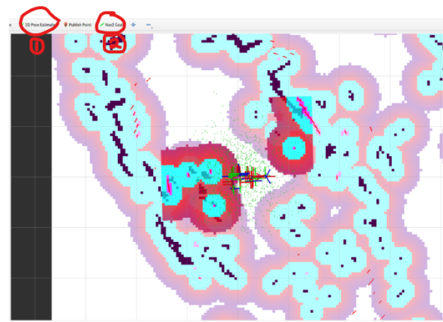
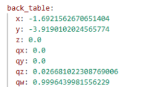
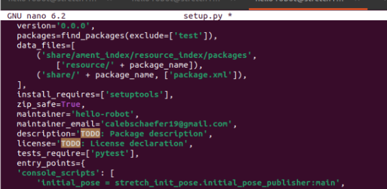

# HRC2SP26

Ongoing work for the Human-Robot Collaboration and Companionship Lab at Cornell University. This project outlines my contributions towards the Stretch RE1 platform and autonomous navigation.

### Pipeline Overview

The general pipeline is as follows. First, I rn the following to begin mapping the room with our Stretch RE1 robot: 

```bash
 ros2 launch stretch_nav2 offline_mapping.launch.py

 ros2 run stretch_core keyboard_teleop

ros2 service call /switch_to_position_mode std_srvs/srv/Trigger {}
```

This involved starting at a specified location, in our case, a corner bounded by a 90-degree wooden box that creates a noticeable landmark in the map for reproducibililty. 

After having driven the robot around the room and orienting it at different angles, I was ready to save the map: 

```bash
source /opt/ros/humble/setup.bash

source ~/ament_ws/install/setup.bash

mkdir -p /home/hello-robot/stretch_user/maps

ros2 run nav2_map_server map_saver_cli -f /home/hello-robot/stretch_user/maps/updated_lab_map
```

In order to get the locations of the starting location, back table, and the table with the robot, I had to first initialize the map and ground the robot with its position in the map. First, initialize the map in RVIZ (this cannot be done headlessly):

```bash
ros2 launch stretch_nav2 navigation.launch.py \
map:=/home/hello-robot/stretch_user/maps/updated_lab_map.yaml
```
Then, navigate to the upper toolbar in RVIZ, and click on "2D Pose Estimate", then with the cursor, move it to the location of the robot in the map (which is why it is beneficial to have such a clear boundary demarquated by a solid boundary that the LiDAR system detects as a wall). 



Then, run the following to echo the position of the robot in the map's frame: 

```bash
ros2 topic echo /amcl_pose
```

Then, copy the output of the ROS 2 topic echo, and place that in the "initial_pose_publisher.py" file (held locally as **ros2_ws_26/src**)

```bash
ros2 pkg create –build-type ament_python stretch_init_pose

cd stretch_init_pose

touch initial_pose_publisher.py

nano initial_pose_publisher.py
```

Then, in order to get the locations of the relevant lab locations (e.g. back table), one must teleoperate their robot around the room to their goal location at their goal pose, using the following teleoperation command in a separate terminal, and use the keyboard to move the RE1 around:

```bash
ros2 run teleop_twist_keyboard teleop_twist_keyboard –ros-args -r cmd_vel:=/stretch/cmd_vel
```
Once at the correct location, use the aforementioned "ros2 topoic echo /amcl_pose" to get the location and orientation of the robot. Copy the output and place it in **/ros2_ws_26/src/stretch_init_pose/config/locations.yaml**. However, this time it doesn't require the covariance term, just the x,y, and z positional vector and the wx, wy, and wz angular orientation. 



Finally, I "cd'ed" into the setup.py file and changed the entry points to reflect the addition of the waypoints ([Setup File](Setup_Files/setup.py)). 




### 1. Calibrate the Robot

In one terminal run:

```bash
stretch_robot_home.py
```

### 2. Initialize Navigation with a Prebuilt Map

In the same terminal, run the following to initialize a previously built map of the room ([Map Start Location File](Setup_Files/start_pos.yaml)) & ([Map Start Location Publisher](Setup_Files/initial_pose_publisher.py)):

```bash
ros2 launch stretch_nav2 navigation.launch.py map:=/home/hello-robot/stretch_user/maps/finalized_map.yaml
```

If you are running a headless version (for example via SSH), run:

```bash
ros2 launch stretch_nav2 navigation.launch.py \
map:=/home/hello-robot/stretch_user/maps/updated_lab_map.yaml \
use_rviz:=false
```

### 3. Ground the Robot in the Map

After building the aforementioned map, the robot must be grounded within the map by specifying a formal location where the robot is positioned.

For reproducibility, the robot was started in a corner during both the map creation process and during later runs.

To specify the location of the robot, run the following in a separate terminal. This passes a location matrix consisting of x, y, and z coordinates, along with angular orientation and covariance values:

```bash
ros2 run stretch_init_pose initial_pose
```

### 4. Navigate to a Target Location

To specify a location to navigate toward, run one of the following commands ([Go-To Location File](Setup_Files/goto_location.py)).

For the location **table_with_robot**:

```bash
ros2 run stretch_init_pose goto_location table_with_robot
```

For the location **back_table**:

```bash
ros2 run stretch_init_pose goto_location back_table
```

These commands function similarly to grounding the robot, using a predefined location matrix to navigate from the initialized robot position to the desired goal location.

## Steps Going Forward
This pipeline wasn't very robust, adn error propogation was very poor (meaning that it wouldn't return to the exact spot during different iterations). Going forward, I'm going to attemp to get Hello-Robot's FunMap Stack running to improve the versatility with SLAM architecture and camera usage rather than reliance only on LiDAR systems. 
